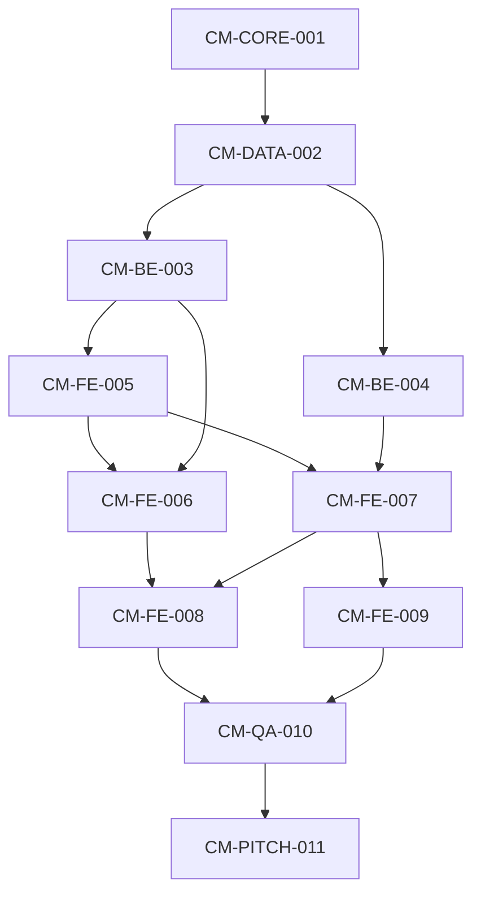

# Diagramme dependances tickets

## Sequence implementation
1. CM-CORE-001
2. CM-DATA-002
3. CM-BE-003 et CM-BE-004 (en parallele)
4. CM-FE-005
5. CM-FE-006 et CM-FE-007
6. CM-FE-008
7. CM-FE-009
8. CM-QA-010
9. CM-PITCH-011g
